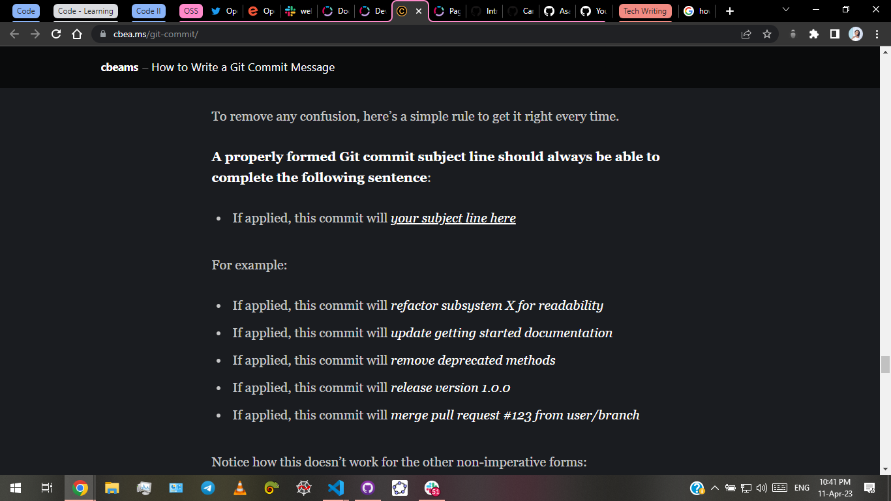

# List of references

## Things that helped with specific info

- [CSS Tricks article](https://css-tricks.com/snippets/css/media-queries-for-standard-devices/)
- [CSS Tricks - Logic in CSS Media Queries](https://css-tricks.com/logic-in-css-media-queries/)
- [Styling Underlines - CSS Tricks](https://css-tricks.com/styling-underlines-web/)
- [Removing horizontal scroll in mobile websites](https://stackoverflow.com/a/76351000/17497724) - an answer to [my question](https://stackoverflow.com/q/76350040/17497724). Acknowledgment for the answer: [HUNAIN AHMED 1002](https://stackoverflow.com/users/21934874/hunain-ahmed-1002)
- 

## Things that taught a new trick

The following websites taught me specifically new tricks / tips, or best practices for doing something, or otherwise a new / better way to do something that I was previously unaware of.

- [CSS Tricks - Logic in CSS Media Queries](https://css-tricks.com/logic-in-css-media-queries/)
- [How to Write a Git Commit Message](https://cbea.ms/git-commit/)

- [Styling Underlines - CSS Tricks](https://css-tricks.com/styling-underlines-web/)

## Things that provide for interesting further reading

- [CSS Tricks article](https://css-tricks.com/snippets/css/media-queries-for-standard-devices/) - because I want to know more about the CSS property `-webkit-min-device-pixel-ratio` as well as the difference between it and `-webkit-device-pixel-ratio`. And also why the former only applies to iPhone...?
- [How to Write a Git Commit Message](https://cbea.ms/git-commit/) - for best practices on writing GitHub commit messages
- [W3C WAI-ARIA](https://www.w3.org/TR/html-aria)

## Always a good reference for best practices

I already know these things, but I will always come back to these for a refresher on best practices.

- [Accessibility Best Practices in HTML - MDN Web Docs](https://developer.mozilla.org/en-US/docs/Learn/Accessibility/HTML)
- [W3C WAI-ARIA](https://www.w3.org/TR/html-aria/#allowed-descendants-of-aria-roles)